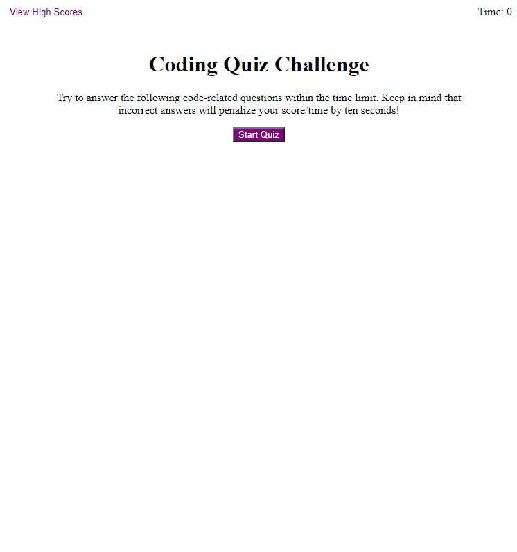

# Coding Quiz

## Description

This page allows a user to practice some coding questions in a multiple choice format and save their scores to compete with themselves.

## Usage

Once the page loads, click on "Start Quiz" to start the timer and begin answering questions. Each wrong answer will remove 10 seconds, so be careful and don't rush too much!

Once all the questions have been answered or time runs out, the user will be taken to a page where they can enter their name/initials to save their time/score to the scoreboard.

The scoreboard can be accessed from anywhere and will display names/initials along with scores from previous attempts, from best to worst. There is a button available to clear all the scores.

## Link and Screenshot

Link to Deployed Application:
* [Coding Quiz](https://acotterson.github.io/CodingQuiz/)

Screenshot:

